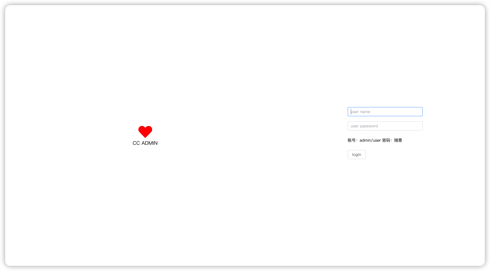
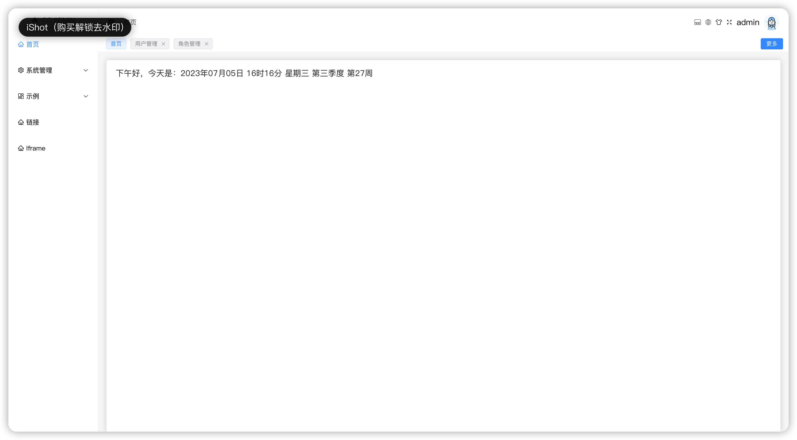
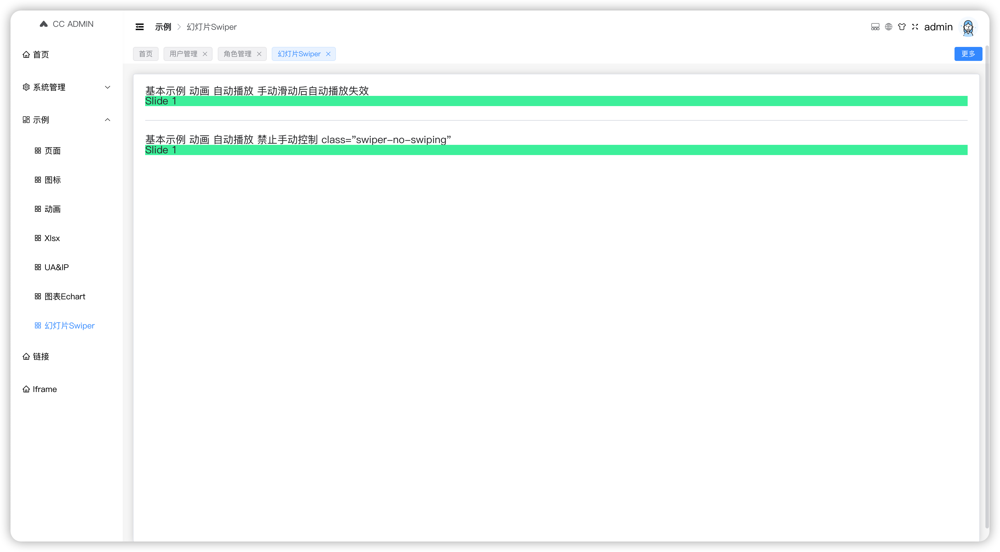
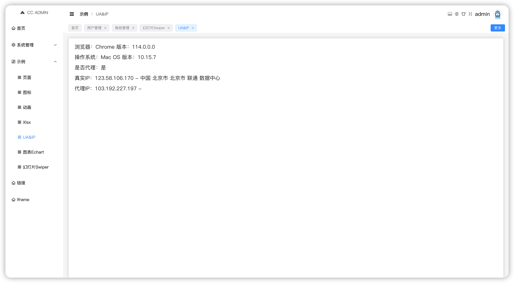

###### 已实现功能 [持续更新]
- [x] vue3 + vite4 + vue-router4 + pinia + element plus + typescript
- [x] 国际化 vue-i18n
- [x] 动态路由/动态菜单
- [x] 权限指令自定义控制
- [x] axios 请求封装
- [x] 集成常用组件：echarts swiper 常用图标库
- [x] 暗黑主题；色弱；灰色主题
- [x] ua基本信息获取以及真实IP与代理IP获取
- [x] mitt
- [x] Mock数据
- [x] 代码格式化：prettier + eslint
- [x] 动态组件导入：省去每个组件内使用 import
- [x] 代码提交校验，若不需要需要删除 package.json 中的 commitizen 相关配置
- [ ] 注意：由于使用了vw，大家若不需要直接删除即可

