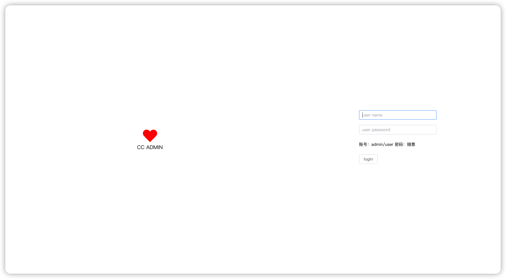
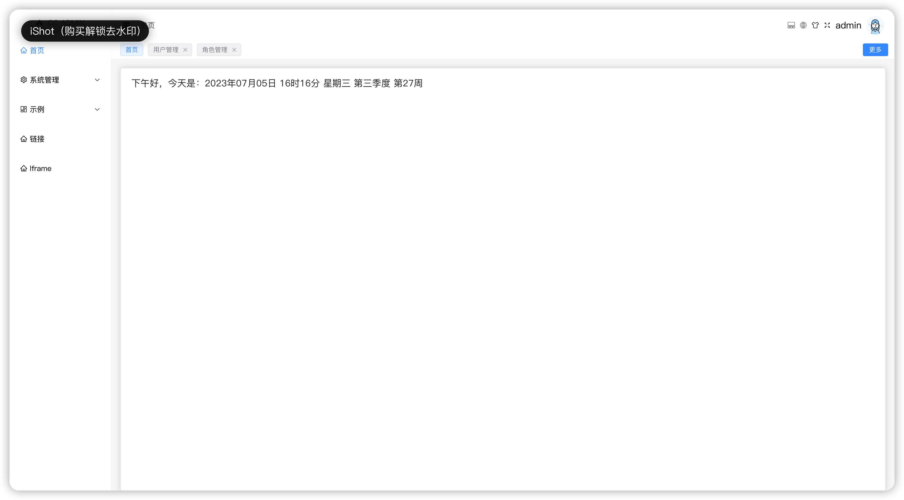
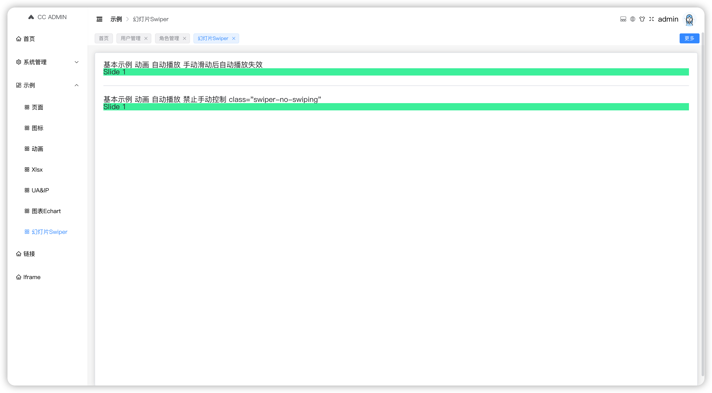
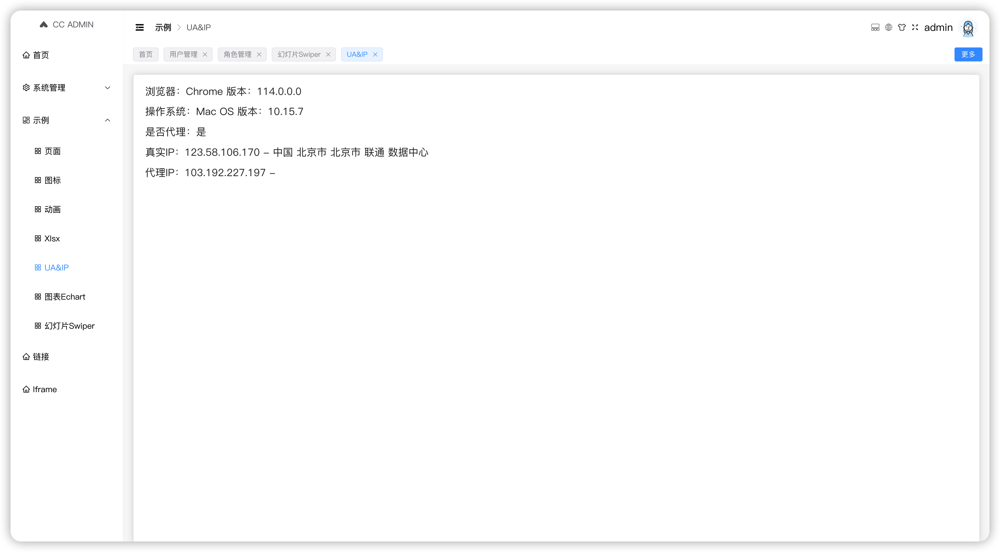

# 已实现功能 [持续更新] [项目核心包](#项目依赖)
- [x] vue3 + vite5 + vue-router4 + pinia + element plus + typescript
- [x] 国际化：vue-i18n
- [x] 动态路由/动态菜单：vue-router v4+
- [x] 权限指令自定义控制
- [x] 请求封装：axios
- [x] 暗黑主题；色弱；灰色主题
- [x] mitt
- [x] Mock数据
- [x] 代码格式化：prettier + eslint（eslint 更新到 v8的最新配置，基本和 v9版本配置保持一致，不再支持 v7及之前的版本）
- [x] 动态组件导入：省去每个组件内使用 import
- [x] 代码提交校验，若不需要需要删除 package.json 中的 commitizen 相关配置
- [x] 示例：常用图标库 + svg
- [x] 示例：echarts
- [x] 示例：swiper
- [x] 示例：ua基本信息获取以及真实IP与代理IP获取
- [x] 示例：工作流 bpmn
- [x] 示例：三方动画 CSS 和 JS
- [x] 示例：抽奖 @lucky-canvas/vue
- [x] 示例：xlsx
- [x] 示例：pdf.js
- [ ] 注意：由于使用了vw，大家若不需要直接删除即可
  
  
  
  

# 项目依赖
| 核心库          | 核心库 -D             |
|--------------|--------------------|
| @vueuse/core |                    |
| vue          |                    |
|              | @vitejs/plugin-vue |
|              | @vue/compiler-sfc  |
|              | esbuild            |
|              | vite               |
|              | typescript         |
|              | vite-plugin-pwa    |
|              | browserslist       |
|              | postcss            |
|              | postcss-html       |
|              | rimraf             |

| 代码格式化 -D               |
|------------------------|
| @eslint/js             |
| eslint                 |
| eslint-config-prettier |
| eslint-plugin-prettier |
| eslint-plugin-vue      |
| globals                |
| typescript-eslint      |

| 样式 -D        |
|--------------|
| less         |
| less-loader  |
| sass         |
| sass-loader  |
| stylelint  |
| stylelint-config-standard  |
| stylelint-config-recommended |

| 提交格式 |
|------|
| husky     |
| lint-staged |
| @commitlint/cli |
| @commitlint/config-conventional |
| @commitlint/types |

```
npx husky init
echo "npm test" > .husky/pre-commit
```

|  |
|--|
|  |
